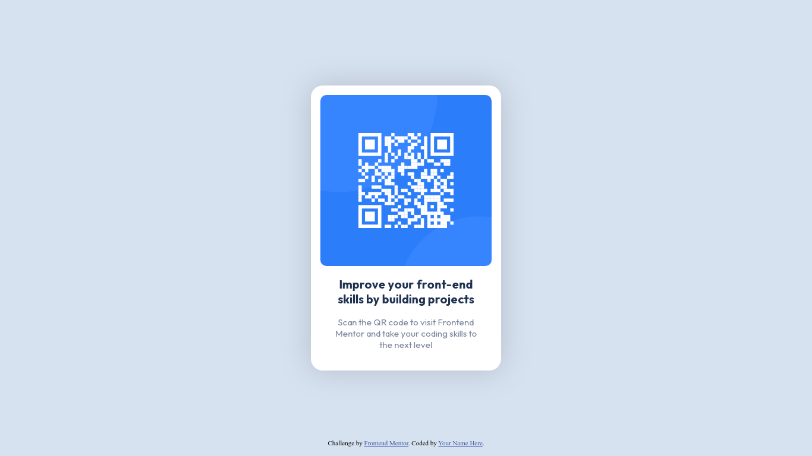

# Frontend Mentor - QR code component solution

This is a solution to the [QR code component challenge on Frontend Mentor](https://www.frontendmentor.io/challenges/qr-code-component-iux_sIO_H). Frontend Mentor challenges help you improve your coding skills by building realistic projects. 

## Table of contents

- [Overview](#overview)
  - [Screenshot](#screenshot)
  - [Links](#links)
- [My process](#my-process)
  - [Built with](#built-with)
  - [What I learned](#what-i-learned)
  - [Continued development](#continued-development)
  - [Useful resources](#useful-resources)
- [Author](#author)

## Overview

### Screenshot



### Links

- [Solution URL](https://github.com/Luzefiru/qr-code-component-main)
- [Live Site URL](https://your-live-site-url.com)

## My process

- Did a CSS reset to remove `margin` & `padding` and set `box-sizing` to `border-box`.
- Created the card container `<div>` first, then aligned the contents with Flexbox's `flex-wrap` property.
- Formatted the `` inside the card to fit using `max-width: 100%` to prevent overflow.
- Added the text's `font-family` (via Google Fonts) & touched up the formatting.
- Added the `box-shadow` on the card.

### Built with

- CSS custom properties
- Flexbox
- Mobile-first workflow
- BEM CSS Naming Standards

### What I learned

```html
<!-- BEM CSS: adding class categories to elements then placing modifiers to indicate what kind of class is it -->
<div class="card card--vertical">
    
    <h2 class="card--vertical__heading">Improve your front-end skills by building projects</h3>
    <p class="card--vertical__body">Scan the QR code to visit Frontend Mentor and take your coding skills to the next level</p>
</div>
```
```css
/* makes an image fit to the parent div */
.card--vertical__img {
  max-width: 100%;
  border-radius: 10px;
}
```
```css
.card--vertical {
  box-shadow: hsl(220, 15%, 75%) 0 0 50px;
  background-color: var(--card-background-color);
  padding: 1rem;

  height: 30rem;
  width: 20rem;
  border-radius: 20px;

  /* align items & wrap them without resorting to flex-direction: column; */
  display: flex;
  flex-wrap: wrap;
  align-items: flex-start;

  text-align: center;
}
```

### Continued development

I need to practice making card components with Flexbox because I keep trying different permutations of Flexbox alignment until I get it right. My difficulties occur when trying to center something.

### Useful resources

- [How to Resize An Image to A Container](https://stackoverflow.com/questions/21103622/auto-resize-image-in-css-flexbox-layout-and-keeping-aspect-ratio) - This StackOverflow article helped me resize my image to my container's size to avoid overflow, without using Bootstrap's `.img-fluid` utility class.

## Author

- Frontend Mentor - [@Luzefiru](https://www.frontendmentor.io/profile/Luzefiru)